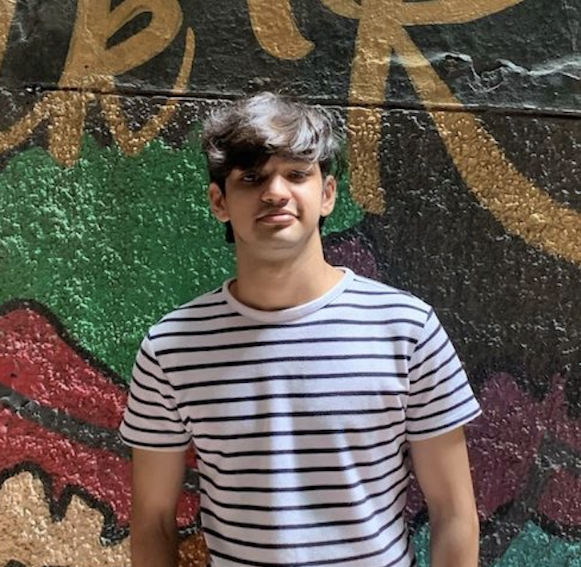

        

Hi! I am Shashank Kirtania (he/him), pre-doctoral research fellow at Microsoft [PROSE team](https://www.microsoft.com/en-us/research/group/prose/). I work with [Gustavo Soares](https://www.microsoft.com/en-us/research/people/gsoares/), [Arjun Radhakrishna](https://www.microsoft.com/en-us/research/people/arradha/) and [Sumit Gulwani](https://www.microsoft.com/en-us/research/people/sumitg/). My current research is about improving repo level code planning and reasoning with help of language models.  
Previously I have been privelged to work with [Soma Dhavala](https://scholar.google.com/citations?user=Rkh1zb8AAAAJ&hl=en) and [Makarand Tapaswi](https://makarandtapaswi.github.io/) during my time at [Wadhwani AI](https://www.wadhwaniai.org) developing AI4Education solution for indic languages which was deployed in Gujarat and have completed over 10,00,000 successful assessments in first 6 months of deployment.    
I have also worked closely with [Thomas Wiecki](https://twiecki.io/) at PyMC labs where I spent most of my time improving workflow of bayesian models employeed by PyMC.
 
I am interested in how ML can help in synthesis, verification and repair of code (ML4PL) and how static analysis can help in better generalizability of algorithms (PL4ML).   I will be applying for PhD in Fall'25 cycle.
