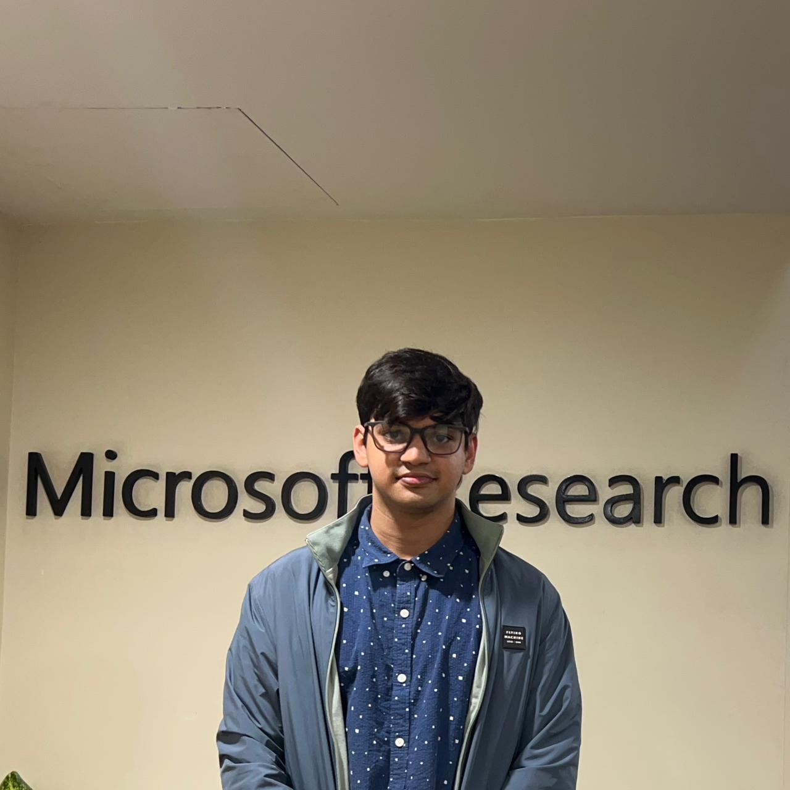

        

Hi! I am Shashank Kirtania (he/him), pre-doctoral research fellow at Microsoft [PROSE team](https://www.microsoft.com/en-us/research/group/prose/). I work with [Gustavo Soares](https://www.microsoft.com/en-us/research/people/gsoares/), [Arjun Radhakrishna](https://www.microsoft.com/en-us/research/people/arradha/) and [Sumit Gulwani](https://www.microsoft.com/en-us/research/people/sumitg/). My current research focuses on enhancing the capabilities of language models (LMs) to understand, generate, and evaluate code. This involves discreet text optimization of prompts through techniques such as automatic prompt optimization, prompt synthesis, and external knowledge integration. Lately, I have been focusing on improving the code generation capabilities of SLMs using constrained decoding.   
`I am applying for PhD positions in the in the Fall'25 cycle.`   
Previously I have been privelged to work with [Soma Dhavala](https://scholar.google.com/citations?user=Rkh1zb8AAAAJ&hl=en) and [Makarand Tapaswi](https://makarandtapaswi.github.io/) during my time at [Wadhwani AI](https://www.wadhwaniai.org) developing AI4Education solution for Indic Languages which was deployed in Indian state of Gujarat and have completed over **1,000,000 successful assessments in first 6 months of deployment.**  
I have also worked closely with [Thomas Wiecki](https://twiecki.io/) at [PyMC Labs](https://www.pymc-labs.com/), where I spent most of my time improving the workflow of Bayesian models present in PyMC.
 
My more formal curriculum vitae could be found [here](https://docs.google.com/viewer?url=https://github.com/5hv5hvnk/5hv5hvnk.github.io/raw/master/Shashank_CV.pdf&embedded=true).
 
 
    
### Publications [`google-scholar`](https://scholar.google.com/citations?user=AT5hwWkAAAAJ&hl=en)

- **_MetaReflection: Learning Instructions for Language Agents using Past Reflections_** [arxiv](https://arxiv.org/abs/2405.13009) 
**Priyanshu Gupta\***, <ins>**_Shashank Kirtania_**</ins>\*, Annanya Singha\*, Sumit Gulwani, Arjun Radhakrishna, Sherry Shi, Gustavo Soares 
Under Review at EMNLP'24       <tab> * = shared first author, last names in alphabetic order  

- **_LOGIC-LM++: Multi-Step Refinement for Symbolic Formulations_** [arxiv](https://aclanthology.org/2024.nlrse-1.6/) 
<ins>**_Shashank Kirtania_**</ins>, Priyanshu Gupta, Arjun Radhakrishna 
Workshop on Natural Language Reasoning and Structured Explanations @ ACL 2024  

- **_DWT-CompCNN: Deep Image Classification Network for High Throughput JPEG 2000 Compressed Documents_** [link](https://scholar.google.com/citations?view_op=view_citation&hl=en&user=AT5hwWkAAAAJ&citation_for_view=AT5hwWkAAAAJ:u5HHmVD_uO8C) 
Tejasvee Bisen, Mohammed Javed, <ins>**_Shashank Kirtania_**</ins>, P Nagabhushan 
Pattern Analysis and Applications, Springer, 2023
